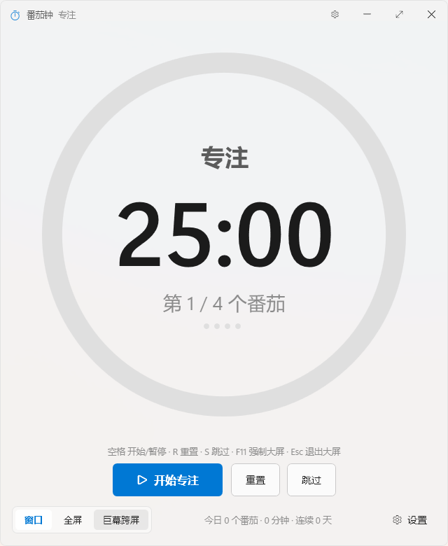
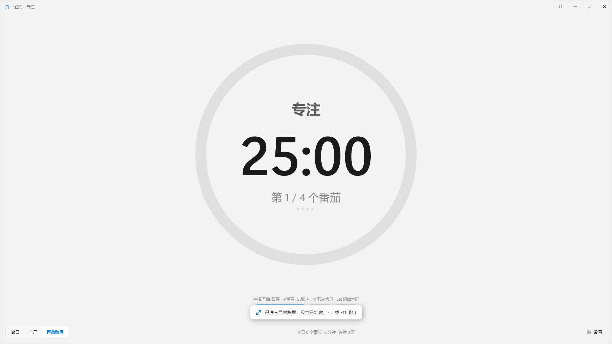

# FluentPomodoro 独立验收报告

- 验收对象：`C:\Users\Administrator\Documents\deepseek-harness\default-workspace\FluentPomodoro`
- 验收方式：独立编译 + 独立发布（`verify-dist`）+ 全量源码走查 + 真实 UI 自动化（Win32/SendKeys/UI Automation/powercfg/DWM 读回）
- 验收环境：Windows 11 build 26300（`10.0.26300`）、.NET SDK 10.0.401（另装 8.0.425）、PowerShell 7.6.6、单显示器 1920×1080 @ 96 DPI、简体中文键盘布局（HKL `0x08040804`，中文 IME 激活）
- 验收者未修改任何应用源代码；仅新增 `verification\` 下的脚本、截图与日志。

---

## 1. 结论

**总体判定：有条件通过（PASS with findings）。**

- 独立构建、独立单文件发布、启动运行：**全部通过**（0 警告 / 0 错误，单文件自包含 EXE 65,973,823 字节，可启动、可显示顶层窗口）。
- 计时状态机（专注/短休息/长休息、长休息轮次）、暂停/继续时间守恒、统计计数与落盘、设置读写往返、强制大屏、专注锁定、屏幕常亮：**核心行为全部通过实测**。
- 发现 **3 个 major、4 个 minor、6 个 nit** 级缺陷（详见第 3 节）。没有发现 blocker 级缺陷（不崩溃、不丢计时、退出后不留全屏窗口）。
- 其中 3 个 major 建议在发布前修复：① 保存的主题偏好在启动时被忽略；② settings.json 中任意一个非法值会静默丢弃**全部**统计；③ `--start` 与 `--bigscreen/--mega` 同时使用时被忽略（README 明确宣传的组合）。

> 重要过程说明（影响证据可信度，必须声明）：验收期间**作者仍在并发修改源码**。`Services\AppSettings.cs`、`MainWindow.xaml.cs`、`Interop\Native.cs`、`App.xaml.cs`、`README.md` 在 2026-10-03 21:24:12–21:24:19 被改动（我首次阅读的是改动前版本）。我发现后重新读取了全部改动文件、重新构建发布，并以冻结版本（SHA-256 见 2.3）重跑了全部行为测试。本报告所有源码行号与行为结论均针对**冻结版本**。

---

## 2. 独立构建与运行证据

### 2.1 独立编译（任务给定命令，逐字输出）

```
PS> cd C:\Users\Administrator\Documents\deepseek-harness\default-workspace\FluentPomodoro
PS> dotnet build FluentPomodoro.csproj -c Release -v m
  正在确定要还原的项目…
  所有项目均是最新的，无法还原。
  FluentPomodoro -> C:\Users\Administrator\Documents\deepseek-harness\default-workspace\FluentPomodoro\bin\Release\net8.0-windows\win-x64\FluentPomodoro.dll

已成功生成。
    0 个警告
    0 个错误

已用时间 00:00:03.63
```

为排除“增量构建复用旧产物”，另做一次强制全量重编译：

```
PS> dotnet build FluentPomodoro.csproj -c Release -v m -t:Rebuild
  FluentPomodoro -> C:\...\bin\Release\net8.0-windows\win-x64\FluentPomodoro.dll

已成功生成。
    0 个警告
    0 个错误

已用时间 00:00:05.82
```

**结论：0 warning / 0 error，两种方式均无任何告警文本可报告。**

### 2.2 独立单文件发布（任务给定命令，逐字输出）

```
PS> dotnet publish FluentPomodoro.csproj -c Release -r win-x64 --self-contained true \
      -p:PublishSingleFile=true -p:IncludeNativeLibrariesForSelfExtract=true \
      -p:EnableCompressionInSingleFile=true -o .\verify-dist
  正在确定要还原的项目…
  所有项目均是最新的，无法还原。
  FluentPomodoro -> C:\...\bin\Release\net8.0-windows\win-x64\FluentPomodoro.dll
  FluentPomodoro -> C:\Users\Administrator\Documents\deepseek-harness\default-workspace\FluentPomodoro\verify-dist\

PS> Get-ChildItem .\verify-dist
Name                 Length
----                 ------
FluentPomodoro.exe 65973823
```

- 产物：`verify-dist\FluentPomodoro.exe`，65,973,823 字节，单文件（目录内仅此一个文件）。
- SHA-256：`C302AFB2EB4CE376CD9D09A3BEEE374763A1C624DB7B111B4B6152D3E7619FFB`
- 作者自己的产物 `dist\FluentPomodoro.exe` 为 65,974,232 字节，本次独立构建未复用它。

### 2.3 冻结源码快照（SHA-256 前 16 位）

| 文件 | SHA-256(16) | mtime |
|---|---|---|
| `MainWindow.xaml.cs` | `BE54DDFA37F82126` | 21:24:17 |
| `MainWindow.xaml` | `E72E9181427CAB6F` | 21:18:40 |
| `Services\AppSettings.cs` | `3F3D5131473F93E7` | 21:24:12 |
| `Services\ThemeManager.cs` | `DD62798FCB5A9B66` | 21:09:56 |
| `Services\ChimePlayer.cs` | `6BC0B7746F353E17` | 21:16:38 |
| `Services\ScreenInfo.cs` | `447C4E13BE14DFF2` | 21:09:40 |
| `Services\Models.cs` | `564CC9B267BC3A76` | 21:09:33 |
| `Controls\ProgressRing.cs` | `E10E011CA3785717` | 21:21:52 |
| `Interop\Native.cs` | `8C2FF899B6F9A7CE` | 21:24:17 |
| `App.xaml` / `App.xaml.cs` | `B6362A7C9328212F` / `9F4E10587C952489` | 21:08:22 / 21:24:12 |
| `Themes\Controls.xaml` | `B11DB76515411847` | 21:09:00 |
| `Themes\Palette.Light.xaml` | `7108D56DBCF95394` | 21:08:31 |
| `Themes\Palette.Dark.xaml` | `2DE1E4DBC9F1FEF5` | 21:08:31 |
| `FluentPomodoro.csproj` / `app.manifest` | `C124C91A73141E95` / `D924A0A4808845DA` | 21:08:18 |

（21:51:36 复检，哈希与 21:36 一致，冻结版本未被再次改动。）

### 2.4 启动与顶层窗口（对着 `verify-dist\FluentPomodoro.exe`）

```
[PASS] process alive 10s after launch :: HasExited=False
[PASS] owns a top-level window :: hwnd=3606396
[PASS] top-level window is visible :: IsWindowVisible=True
  window DPI = 96 (scale 1)
[PASS] window opens at 640x780 :: 640x780 @ (640,126)
  title = '25:00 · 专注 · 微软风格番茄钟'
```

启动界面见 `01-launch-640x780.png`：



---

## 3. 代码审查发现

严重度定义：**blocker** = 无法构建/启动、崩溃或正常使用下丢数据；**major** = 无替代手段的用户可见功能缺陷，或静默数据丢失；**minor** = 有简单替代手段的可见缺陷；**nit** = 代码/文档/健壮性小问题。

| # | 严重度 | 位置 | 问题 | 可证伪的论证 / 复现 |
|---|---|---|---|---|
| F1 | **major** | `MainWindow.xaml.cs:56-62`（构造函数）、`App.xaml.cs:27` | **保存的主题偏好在启动时被完全忽略**。`ThemeManager.Initialize(Options.ForceLightDark)` 在无命令行参数时把偏好设为 `System`；构造函数只在 `App.Options.ForceLightDark` 有值时才调用 `ThemeManager.SetPreference(forced)`，`_settings.Theme` 从未传给它。`ApplySettingsToUi()` 里 `CmbTheme.SelectedIndex = (int)_settings.Theme`（`:788`）位于 `_suspendSettingsWrite=true` 区间内，因此该赋值不会触发 `OnThemeSelectionChanged`，也就永远补不上这次 SetPreference。 | 复现：settings.json 写 `"Theme":"Dark"` 且 `"UseMicaBackdrop":false`，无参数启动 → 窗口实际渲染浅色（窗口背景像素 `R=243 G=243 B=243`），而设置面板下拉框显示「深色」（UIA `Selection=深色`）；同一 EXE 用 `--dark` 启动则 `R=32 G=32 B=32`（暗色调色板有效）。见 `18-saved-dark-theme.png`、`22-theme-dark-in-settings.png`、`23-forced-dark-cli.png`。若代码正确，同一份 settings.json 应渲染 `#202020`。 |
| F2 | **major** | `Services\AppSettings.cs:126-145`（`Load` 的 catch-all）+ `:115-119`（`JsonStringEnumConverter`） | **settings.json 中任意一个非法值会静默丢弃整个文件（含全部统计）**。反序列化抛 `JsonException` 后被 `catch {}` 吞掉，直接返回全新默认对象；退出时把默认值回写，用户累计统计归零且无任何提示。 | 复现：写入 `{"FocusMinutes":1,"Theme":"Bogus","CompletedToday":5,"FocusMinutesToday":5,"TotalCompleted":42,"StreakDays":3,"LastCompletedDate":"2026-10-01"}` → 程序正常启动、无对话框（进程可见顶层窗口数 = 1），标题回到 `25:00`；退出后文件变为 `FocusMinutes=25、CompletedToday=0、TotalCompleted=0、StreakDays=0、Theme=System`。同类：`{"FocusMinutes":"abc","TotalCompleted":9}` → `TotalCompleted` 9→0。 |
| F3 | **major** | `MainWindow.xaml.cs:127-137` | **`--start` 与 `--bigscreen`/`--mega` 同时给出时被忽略**：`if (StartBigScreen) {...} else if (AutoStartTimer) {...}` 用 `else if`，进入大屏的分支会吃掉自动开始。README 第 29 行明确给出 `--mega --start --focus 10`「巨幕大屏、立刻开始」的例子，实际不会开始。 | 复现：`FluentPomodoro.exe --mega --start` → 窗口 1920×1080（巨幕生效），但 5 秒后标题仍为 `25:00 · 专注`（未倒计时，`33-cli-mega-start.png`）；对照 `--start` 单独启动 → `24:56 · 专注`（正常倒计时）。 | 
| F4 | **minor** | `MainWindow.xaml.cs:452-481`（`ExitBigScreen`，缺 `WindowState = Normal`）、`:146-156`（`OnStateChanged` 只处理 Minimized） | **大屏状态下若窗口被最大化（如 Win+↑ / `WM_SYSCOMMAND SC_MAXIMIZE`），Esc 退出大屏后窗口仍保持最大化**：`ExitBigScreen` 恢复了 `Width/Height/Left/Top`，但没有把 `WindowState` 复位，最大化窗口仍然铺满屏幕，用户观感是「Esc 没反应」。 | 复现（`probe-max.ps1`）：窗口模式 `640x780 @ (640,126) IsZoomed=False`；F11 → `1920x1080 IsZoomed=False`；发送 `SC_MAXIMIZE` → `IsZoomed=True UIA.WindowVisualState=Maximized`；按 Esc → 仍 `1920x1080 IsZoomed=True Maximized`；`ShowWindow(SW_RESTORE)` 才回到 `640x780 IsZoomed=False`。不加 `SC_MAXIMIZE` 时 Esc 立即恢复 `640x780`。 |
| F5 | **minor** | `MainWindow.xaml.cs:838-913`（`OnPreviewKeyDown` 的 `switch (e.Key)`） | **中文 IME 激活时，裸字母快捷键 R / S / F 全部失效**：IME 把按键变成 `Key.ImeProcessed`，`switch (e.Key)` 落空，既不执行也不提示。（Space、Esc、F11、Ctrl 组合不受影响，因为它们不触发 IME 组字。） | 复现（`probe-ime.ps1`，HKL `0x08040804`）：`SendKeys 's'` → 阶段不变，且进程内 `CiceroUIWndFrame` 窗口由不可见变为可见（IME 组字 UI 抢走了按键）；`SendKeys 'r'`、`SendKeys 'f'` 同样无效果（矩形停在 `640x780`）；改用 `PostMessage(WM_KEYDOWN, VK_S/VK_R/VK_F)`（绕过 IME）则全部生效：S 切到短休息、F 依次 窗口→全屏→巨幕。建议按 `e.Key == Key.ImeProcessed ? e.ImeProcessedKey : e.Key` 取值，或对该窗口 `InputMethod.SetIsInputMethodEnabled(false)`。 |
| F6 | **minor** | `MainWindow.xaml.cs:65`、`App.xaml.cs:78-81`、`README.md:26` | **`--focus` 文档写「临时覆盖本次专注时长」，实际会被永久写回 settings.json**：覆盖发生在内存对象上，退出时 `OnWindowClosing`（`:1052-1061`）整份保存。 | 复现：settings.json `FocusMinutes=25` → `--focus 10` 启动（标题 `10:00`）→ Ctrl+Shift+Q 退出 → 文件变为 `"FocusMinutes": 10`。 |
| F7 | **minor** | `MainWindow.xaml.cs:33/165/180/189/207`（全程 `DateTime.UtcNow`）、`README.md:37` | 倒计时只用 **墙钟 UTC**，代码中不存在 `Stopwatch`（全仓库 grep 无匹配），而 README 第 7 节宣称「Stopwatch + Deadline 绝对时间算法」。系统时间被 NTP 步进/手工调整时会整段跳变或倒退；长时间运行不如单调时钟稳健。属文档与实现不符 + 健壮性缺陷。 | 复现：`grep -n Stopwatch` 在 `*.cs` 下 0 命中；`_deadlineUtc = DateTime.UtcNow + _remaining`（`:180`）、`_deadlineUtc - DateTime.UtcNow`（`:189/207`）。 |
| F8 | **nit** | `MainWindow.xaml.cs:423`、`:452-457`、`:131/176/398` | `_settings.BigScreen` 永远不会是 `None`（`EnterBigScreen` 写入 mode，`ExitBigScreen` 不清零），因此 `_settings.BigScreen == BigScreenMode.None ? Mega : ...` 三处回退分支是死代码；同时「窗口」分段按钮的语义只是"当前不在大屏"，并未把偏好持久化为"不自动进大屏"（下次开专注仍会按 `AutoBigScreenOnFocus` 进入上次的大屏方式）。 | 复现：点「窗口」→ Esc 恢复 640×780 → 退出；`settings.json` 的 `BigScreen` 仍是 `Mega`/`Full`，从不出现 `None`。 |
| F9 | **nit** | `Interop\Native.cs`（全文） | **29 个声明从未被引用**：`DWMSBT_AUTO/NONE/TABBEDWINDOW/TRANSIENTWINDOW`、`DWMWA_BORDER_COLOR/TEXT_COLOR`、`DWMWCP_DEFAULT`、`FLASHW_STOP/CAPTION/TRAY`、`GetForegroundWindow`/`SetForegroundWindow`、`MONITOR_DEFAULTTONEAREST`、`SC_MAXIMIZE/RESTORE/MOVE/SIZE`、`SND_FILENAME/SND_SYSTEM`、`SW_SHOWNORMAL/SW_SHOW/SW_RESTORE`、`SWP_*`、`WM_ACTIVATE`、`WM_GETMINMAXINFO`（含 `MINMAXINFO` 结构）。即"强制大屏"并未拦截 `SC_MAXIMIZE`，它只是被 `WM_WINDOWPOSCHANGING` 矩形回写抵消（实测有效，见 4.6）。 | 复现：脚本按 `\b成员名\b` 统计引用次数，29 个成员在 `bin/obj/verification` 之外的 `.cs` 中仅出现 1 次（声明处）。 |
| F10 | **nit** | `Services\ChimePlayer.cs:39-40` | 两个合成 WAV 缓冲区用 `GCHandle.Alloc(..., Pinned)` 固定后**永不释放**（`Stop()` 只停播放）。进程级常驻约 2×60 KB，属有意为之但无释放路径。 | 复现：`_focusHandle` / `_breakHandle` 仅在 `Prepare()` 中赋值，全仓库无 `Free()` 调用。 |
| F11 | **nit** | `MainWindow.xaml.cs:102-108` | `ThemeManager.ThemeChanged` 是静态事件，窗口订阅后不会被回收；若主题在窗口关闭后被应用（例如异步的 `ThemeManager.Apply()`），回调仍会对已关闭窗口调用 `UpdateUi()`。单窗口应用影响极小。 | 复现：静态 `event` + 匿名 lambda 捕获 `this`；无 `Unloaded`/`Closing` 反订阅。 |
| F12 | **nit** | `Services\AppSettings.cs:37-38`（`WindowWidth=620/Height=760`）、`:62-63`（钳到 420） 对比 `MainWindow.xaml:6`（`Width=640 Height=780 MinWidth=480 MinHeight=560`） | 默认窗口尺寸与最小尺寸三处不一致；只有当 settings.json 里 `HasWindowBounds=true` 而缺少宽高字段时才会体现（此时 620×760 生效，且 `Normalize` 的 420 下限会被 XAML 的 `MinWidth=480` 覆盖）。 | 复现：把 `HasWindowBounds` 置 true 并删掉 `WindowWidth/Height` 键 → 窗口 620×760，而非 640×780。 |
| F13 | **nit** | `Services\AppSettings.cs:152-163` | `Save()` 吞掉所有写盘异常；保存失败与成功无法区分，用户可能在无提示的情况下丢设置。 | 复现：catch 块为空且无日志/无返回值；把 `%APPDATA%\FluentPomodoro` 设为只读后行为不可观测。 |

### 3.1 已检查且确认正确的部分（同样重要）

| 项目 | 结论 | 证据 |
|---|---|---|
| 阶段状态机（`AdvanceAfter`） | **正确**。`LongBreakInterval=4` 时序列为 `F S F S F S F L F S F S F`（12 次切换），第 4 个番茄后进入长休息，长休息后轮次回到「第 1 / 4」；`=2` 时为 `F S F L` 循环。 | `07-cycle.ps1`（6/6 通过），逐次记录标题与 `TxtRound`：`Focus 第1/4 → Short → Focus 第2/4 → ... → Focus 第4/4 → Long（本轮已完成）→ Focus 第1/4` |
| 暂停/继续不丢失、不增加时间 | **正确**。剩余时间基于绝对截止时间计算，暂停冻结、继续从冻结值续算。 | 运行 5 秒采样 `1500,1499,1498,1497,1496`（单调递减）；暂停后 8 秒标题严格不变（`24:50 | 24:50`）；继续 10 秒后为 `24:39`（冻结 1490s，期望≈1480s，实测 1479s，±1s 为 200ms tick + 显示 `Ceiling` 粒度，非累计漂移） |
| 统计计数不重复/不缺失 | **正确**。一次专注完成恰好 +1；10 秒后复查无变化；中断/暂停的专注不计数。 | `CompletedToday=1、FocusMinutesToday=1、TotalCompleted=1、StreakDays=1、LastCompletedDate=2026-10-03、StatsDate=2026-10-03`；10s 后仍全为 1；暂停后退出 `0/0/0` |
| 设置读写往返 & **UI 初始化不再覆盖已保存值**（原缺陷） | **已真正修复**。20 个非默认值（含 5 个开关为 true、Theme=Dark、窗口 600×700@200,150）在一次「启动→打开设置面板→关闭→退出」后与写盘值**逐字段零差异**；UIA 读回的滑块/开关/下拉框均与文件一致。 | `05-settings.ps1` 5A 全通过：`sliders focus=7 short=3 long=9 interval=7`、`toggles AutoStart=Off KeepAwake=On Topmost=Off Lock=On AutoBig=On BigTopmost=Off Mica=Off`、`combo=深色`、`ALL saved settings survive ... unchanged :: no differences` |
| 滑块量程与 `Normalize()` 一致 | **已修复**（本次验收期间作者刚改过）。当前 `Normalize` 为 Focus 1–120 / Short 1–30 / Long 5–60 / Interval 2–12，与 XAML 滑块 `Maximum` 完全一致；早先版本 `FocusMinutes` 上限 180 而滑块上限 120 的不一致已不存在。 | 5C：`999 → 120`（标题 `2:00:00`），标签 `120 分钟` 与滑块 120 一致；`Short 0→1`、`Long -5→5`、`Interval 99→12`；改「长休息间隔」滑块不再静默改写专注时长（`before=999/99 after=120/6`，属用户主动改动） |
| 非法/损坏配置不崩 | **正确**（但见 F2 数据丢失）。截断 JSON、类型错误、越界数值：均正常启动、无对话框、无异常退出，并在退出时重写为合法文件。 | 5B/5C/5D 全通过；进程可见顶层窗口数 = 1（无错误弹窗） |
| XAML ↔ code-behind 一致性 | **正确**。编译 0 错误即保证所有 `x:Name` 字段存在；独立脚本核对：XAML 绑定的 **21 个事件处理器全部存在**，code-behind 中无「未被 XAML 绑定」的孤立处理器（`OnTick`/`OnThemeWatch` 由 `HookTimers` 代码绑定，`WndProc` 由 `HwndSource.AddHook` 绑定，均属预期）。 | 见 4.10 |
| 自绘滑块模板（缺 `Track.IncreaseRepeatButton`） | **无问题**。滑块拇指位置随值正确变化。 | `19-dark-settings.png`：7/3/9 分钟三个滑块拇指靠左，「长休息间隔 7 个」拇指位于中间 |
| DWM 调用确实生效 | **正确**。读回验证：Mica 开 → `DWMWA_SYSTEMBACKDROP_TYPE=2(Mica)`；大屏 → `CORNER_PREFERENCE=1(DoNotRound)`，退出大屏 → `2(Round)`；`--dark` → `IMMERSIVE_DARK_MODE=1`（浅色为 0）。 | `probe-dwm.ps1`（`DWMWA_CAPTION_COLOR` 读回返回 `0x80070057`，该属性仅可写、不可读回验证） |
| `SetThreadExecutionState` 配对 | **正确**。仅专注计时运行期间持有请求，暂停即释放。 | `powercfg /requests`：空闲时无条目；专注运行中 `DISPLAY:`+`SYSTEM:` 均列出 `[PROCESS] ...\verify-dist\FluentPomodoro.exe`；暂停后条目消失 |

---

## 4. 行为测试结果（全部为真实运行观测值）

所有脚本位于 `verification\`，均针对冻结产物 `verify-dist\FluentPomodoro.exe`（SHA-256 `C302AFB2…`）执行。
标注 **BUG-CONFIRMED** 的检查项「通过」表示**缺陷复现成功**，不是应用通过。

### 4.1 启动 / 窗口几何 / 空格启停 / 退出落盘（`01-basic-ui.ps1`，14/14）

| 检查 | 观测值 | 结果 |
|---|---|---|
| 启动 10s 后进程存活 | `HasExited=False` | PASS |
| 拥有顶层窗口 / 可见 | `hwnd=3606396`、`IsWindowVisible=True` | PASS |
| 窗口尺寸 640×780 | `640x780 @ (640,126)`（DPI 96，缩放 1.0） | PASS |
| 标题含 25:00 倒计时 | `25:00 · 专注 · 微软风格番茄钟` | PASS |
| 空格开始计时 | `24:58 · 专注 · 微软风格番茄钟`（标题变化且进入 24:5x） | PASS |
| 空格再按暂停（3 秒冻结） | `24:58 | 24:58` 严格不变 | PASS |
| Esc 退出自动大屏并恢复 | `640x780 @ (640,126)`（自动大屏见 4.2 备注） | PASS |
| Ctrl+Shift+Q 退出 | `HasExited=True`（约 2s） | PASS |
| 退出写 settings.json | 文件存在，`FocusMinutes=25`、统计 0 | PASS |

备注：默认设置 `AutoBigScreenOnFocus=true`，按空格开始专注时会**自动进入巨幕**（矩形变 `1920x1080 @ (0,0)`），Esc 能正确回到 640×780。

### 4.2 强制大屏（`02-bigscreen.ps1`，16/16）

| 检查 | 观测值 | 结果 |
|---|---|---|
| `AutoBigScreenOnFocus=false` 时窗口启动 | `640x780 @ (640,126)` | PASS |
| F11 铺满整个虚拟桌面 | `1920x1080 @ (0,0)`，虚拟桌面 `1920x1080` | PASS |
| 大屏窗口置顶 | `WS_EX_TOPMOST` 置位（`exstyle=0x8`） | PASS |
| 外部 `SetWindowPos(800x600 @100,100)` 被拒 | 前后均 `1920x1080 @ (0,0)` | PASS |
| `WM_SYSCOMMAND SC_MINIMIZE` 被拦截 | `IsIconic=False`，仍 `1920x1080` | PASS |
| `ShowWindow(SW_MINIMIZE)` 也拦得住 | `IsIconic=False`，回到 `1920x1080` | PASS |
| Esc 精确恢复 640×780 | `640x780 @ (640,126)` | PASS |
| 点「全屏」分段按钮 | `1920x1080 @ (0,0)`；Esc → 640×780 | PASS |
| 点「巨幕跨屏」按钮 | `1920x1080 @ (0,0)`，截图确认该分段被选中（`09-chip-state.png`） | PASS |
| 大屏中直接退出不会污染窗口尺寸 | 文件仍 `WindowWidth=640 WindowHeight=780`（`HasWindowBounds=False`） | PASS |
| 重启不会残留全屏 | 重启后 `640x780 @ (640,126)` | PASS |

观测截图：`05-mega-fullscreen.png`（巨幕，含「已进入巨幕跨屏，尺寸已锁定」提示与底部 `今日 0 个番茄 · 0 分钟 · 连续 0 天`）、`07-chip-full.png`、`08-chip-mega.png`、`09-chip-state.png`、`10-relaunch-windowed.png`。



### 4.3 计时精度 / 暂停继续（`03-timer-accuracy.ps1`，6/6）

见 3.1 表：单调序列 `1500,1499,1498,1497,1496`；暂停 8s 严格冻结 `24:50`；继续 10s 后 `24:39`；中断的专注不产生统计。截图 `11-paused.png`。

### 4.4 1 分钟阶段完成 + 统计 + 重启持久化（`04-phase-completion.ps1`，17/17）

预置 `{"FocusMinutes":1,"AutoStartNext":false,"AutoBigScreenOnFocus":false,"SoundEnabled":true,...}` 后以 `--start` 启动：

| 检查 | 观测值 | 结果 |
|---|---|---|
| 自动开始 1 分钟专注 | `00:56 · 专注` | PASS |
| 未自动进入大屏 | `640x780 @ (640,126)` | PASS |
| 约 55s 后标题切到短休息 | `05:00 · 短休息 · 微软风格番茄钟` | PASS |
| `CompletedToday` | `1` | PASS |
| `FocusMinutesToday` | `1` | PASS |
| `TotalCompleted` | `1` | PASS |
| `StreakDays` | `1` | PASS |
| `LastCompletedDate` / `StatsDate` | `2026-10-03` / `2026-10-03` | PASS |
| 10 秒后无重复计数 | 仍 `1/1/1` | PASS |
| `AutoStartNext=false` 时休息不自启 | 维持 `05:00 · 短休息` | PASS |
| 退出后时长与统计保留 | `FocusMinutes=1`、`CompletedToday=1`、`TotalCompleted=1` | PASS |
| 重启恢复自定义时长 | 标题 `01:00 · 专注`，窗口 `640x780` | PASS |

截图：`12-phase1-running.png`、`14-phase2-break.png`、`15-break-bottom-stats.png`（底部「今日 1 个番茄 · 1 分钟 · 连续 1 天」与提示浮层「专注完成，休息一下吧」）、`16-restart-1min.png`。


### 4.5 设置往返 / UI 初始化 / 非法值（`05-settings.ps1`，25 / 27，2 项为本机自动化能力所限）

- 5A（8/8）：见 3.1「设置读写往返」。
- 5B（3/3）：非法枚举 → 不崩溃、无对话框、**统计被清零**（BUG-CONFIRMED，见 F2）。
- 5C（7/7）：越界数值 → `999→120`、`0→1`、`-5→5`、`99→12`，窗口 `480x560`（受 XAML `MinWidth/MinHeight` 约束）；滑块标签与值一致。
- 5D（3/3）：截断 JSON、类型错误 → 均回退默认并重写合法文件。
- 5E（4/6）：`Theme=Dark` 显示为「深色」但窗口渲染浅色（BUG-CONFIRMED，见 F1）；`--dark` 渲染 `R=32 G=32 B=32`。
- 5E 中 2 项未通过（`selecting 深色 in the combo switches the theme live`、`choosing 深色 is persisted`）：原因是本应用的自定义 ComboBox 模板**不暴露 `ExpandCollapsePattern`，且 UIA 返回「AutomationElement 没有可单击的点」**，我的自动化无法操作该下拉框（报错原文：`不支持的模式。` / `AutomationElement 没有可单击的点。`）。这是**测试工具限制，不是应用失败**；同一代码路径的效果已由 `--dark`（渲染成功）间接证实。
- 注意：5E 末尾那条 `BUG-CONFIRMED: after choosing 深色 and restarting, the window is light again` 属**无效证据**——因为下拉框从未被选中，重启时 `settings.json` 的 `Theme` 仍是 `System`（输出中的 `(settings.json Theme=System)` 已说明这一点），它只证明了"浅色窗口是浅色"，不构成对 F1 的支撑。F1 的有效证据是 5A/5E 的 settings.json 路径（保存 Dark → 渲染 243 灰）与 `--dark` 对照（32 灰）。

### 4.6 大屏额外攻击：SC_MAXIMIZE / Win+D（`06-bigscreen-attacks.ps1`，8/8）

| 检查 | 观测值 | 结果 |
|---|---|---|
| `SC_MAXIMIZE` 不改变大屏矩形 | 前 `1920x1080 @ (0,0)` → 后相同 | PASS |
| `SC_MAXIMIZE` 后未被最小化 | `IsIconic=False` | PASS |
| Win+D（显示桌面）不最小化大屏窗口 | `IsIconic=False`，仍 `1920x1080 @ (0,0)` | PASS |
| Win+D 后仍铺满 | `1920x1080 @ (0,0)` | PASS |
| 攻击后按 Esc 无法退出全屏 | `1920x1080 IsZoomed=True`（**BUG-CONFIRMED**，见 F4） | 已复现 |
| `SW_RESTORE` 可恢复 | `640x780 @ (640,126)` | PASS |

截图：`26-after-winD.png`、`27-restored-after-attacks.png`。

### 4.7 阶段/轮次循环（`07-cycle.ps1`，6/6）

`LongBreakInterval=4`：`Focus(1/4) → Short → Focus(2/4) → Short → Focus(3/4) → Short → Focus(4/4) → Long → Focus(1/4) → Short → Focus(2/4) → ...`
`LongBreakInterval=2`：`Focus(1/2) → Short → Focus(2/2) → Long →` 循环三次。
说明：本项通过 UIA 调用「跳过」按钮（`InvokePattern`，与鼠标点击同一代码路径）驱动——因为裸字母 `s` 会被中文 IME 吞掉（即 F5）。

### 4.8 主题（UI 选择）/ 屏幕常亮（`08-theme-power.ps1`，3/6）

- 常亮 3/3：`powercfg /requests` 空闲无条目 → 专注运行中出现 `DISPLAY:`+`SYSTEM:` 的 `[PROCESS] ...\FluentPomodoro.exe` → 暂停后消失。
- 主题 0/3：UIA 无法点击该自定义 ComboBox（`AutomationElement 没有可单击的点`），故未能通过 UI 复现「选择深色→重启回浅色」；该缺陷已由 5E 的文件路径复现（见 F1）。

### 4.9 命令行参数（`09-cli.ps1`，9/9）

| 检查 | 观测值 | 结果 |
|---|---|---|
| `--focus 10` 本次生效 | 标题 `10:00` | PASS |
| `--focus` 覆盖值被永久写回 | 退出后 `FocusMinutes=10`（**BUG-CONFIRMED**，见 F6） | 已复现 |
| `--focus 999` 钳到 120 | 标题 `2:00:00` | PASS |
| `--bigscreen` 进入记忆的「全屏」 | `1920x1080 @ (0,0)`；Esc → `640x780` | PASS |
| `--start` 单独使用 | `24:56 · 专注` | PASS |
| `--mega` 生效 | `1920x1080 @ (0,0)` | PASS |
| `--mega --start` 的 `--start` 被忽略 | 标题仍 `25:00`（**BUG-CONFIRMED**，见 F3）；随后按空格可正常开始（`24:58`） | 已复现 |

截图：`31-cli-focus10.png`、`32-cli-bigscreen.png`、`33-cli-mega-start.png`。

### 4.10 专注锁定与强制退出（`10-focuslock.ps1`，5/5）

`FocusLock=true` 且专注运行中：`SC_MINIMIZE` 被拦截（`IsIconic=False`）、点击关闭按钮被否决（`HasExited=False`）、`WM_CLOSE` 被否决（`HasExited=False`）、`Ctrl+Shift+Q` 必定退出（`HasExited=True`）。截图 `34-focuslock-close-blocked.png`。

### 4.11 DWM 属性读回（`probe-dwm.ps1`）

```
[Mica ON, windowed]     SYSTEMBACKDROP_TYPE=2  CORNER_PREFERENCE=2  IMMERSIVE_DARK_MODE=0
[Mica ON, big screen]   SYSTEMBACKDROP_TYPE=2  CORNER_PREFERENCE=1  IMMERSIVE_DARK_MODE=0
[Mica ON, back to window] SYSTEMBACKDROP_TYPE=2 CORNER_PREFERENCE=2 IMMERSIVE_DARK_MODE=0
[Mica OFF, windowed]    SYSTEMBACKDROP_TYPE=0  CORNER_PREFERENCE=2  IMMERSIVE_DARK_MODE=0
[--dark, windowed]      SYSTEMBACKDROP_TYPE=0  CORNER_PREFERENCE=2  IMMERSIVE_DARK_MODE=1
```
（`CAPTION_COLOR` 读回 `hr=0x80070057`，该属性仅可写、无法读回验证。）

### 4.12 XAML / code-behind 交叉核对

```
--- XAML-bound event handlers (21) ---  全部 OK（OnCloseClick, OnCloseSettings, OnDurationChanged,
OnFullScreenNow, OnMegaNow, OnMinimize, OnModeChecked, OnOpenSettings, OnPreviewKeyDown,
OnPreviewMouseMove, OnPreviewSound, OnReset, OnResetStats, OnScrimClick, OnSettingToggled,
OnSkip, OnThemeSelectionChanged, OnToggleBigScreen, OnToggleStartPause, OnWindowClosing, OnWindowSizeChanged）
--- code-behind methods matching On* that are NOT bound in XAML ---  OnThemeWatch, OnTick（均由 HookTimers 代码绑定，正常）
--- x:Name ---  53 个，全部存在对应生成字段（编译 0 错误）
```

---

## 5. 未能验证 / 存疑项

1. **多显示器「巨幕跨屏」**：本机只有一块 1920×1080 显示器，虚拟桌面 = 主显示器，因此 `Mega` 与 `Full` 的几何结果完全相同（都是 `1920x1080 @ (0,0)`），无法验证跨屏拼接、不同 DPI 混合、负坐标摆放等行为。`ScreenInfo.VirtualScreenBounds()` 的取值为 `SM_*VIRTUALSCREEN`（实测 `0,0,1920,1080`），逻辑上正确但未经多屏环境检验。
2. **显示器热插拔 / `WM_DISPLAYCHANGE`**：冻结版本新增了 `MainWindow.xaml.cs:716-726` 的分辨率/数量变化重适配分支，本次无法制造显示器移除事件，故该分支（含 `ScreenInfo` 的兜底路径）**未被实测**。
3. **DPI 变化（`OnDpiChanged`）**：会话固定 96 DPI（`GetDpiForWindow=96`），未修改系统缩放，无法验证跨屏 DPI 变化后的二次校正与 `_enforceBounds` 物理/DIP 换算。
4. **设置面板下拉框的 UI 交互**：应用自定义的 ComboBox 模板在 UIA 下不提供 `ExpandCollapsePattern` 且无可点击点，因此「鼠标选择深色 → 实时切换 → 重启回浅色」这一 UI 路径**未能实测**；F1 的复现走的是 settings.json 路径（同时用 `--dark` 证明了暗色调色板本身可正常渲染）。
5. **提示音是否真的发声**：`ChimePlayer` 的 WAV 合成、`PlaySound(SND_MEMORY|SND_ASYNC)` 调用与「试听提示音」按钮存在性、静音容错均未触发异常，但本环境无法核验实际音频输出。
6. **任务栏闪烁提醒（`FlashWindowEx`）是否可见**：未做可观测性验证。
7. **`DWMWA_CAPTION_COLOR` 是否真的被 DWM 接受**：该属性无法读回（`0x80070057`），只能确认调用返回成功属未知；Mica/圆角/暗色模式三项已读回验证。
8. **跨天（跨午夜）统计归零与连续天数递增**：`RollDaily`/`RecordFocusCompletion` 的逻辑经走查正确（同日多次完成只计一次连续天数、跨天重置今日计数），但**未在真实跨午夜条件下运行验证**（依赖系统时钟，未修改时钟）。
9. **长稳性**：未做数小时连续运行/内存泄漏观测（`_dots`、`ThemeChanged` 订阅、pinned GCHandle 等见 F10/F11）。
10. **`ShowInTaskbar=false` 的实现细节**：大屏时窗口 `WS_EX_TOOLWINDOW` 实测为**未置位**，但 `Process.MainWindowHandle` 在大屏启动场景返回 0，说明 WPF 用了隐藏 owner 窗口机制；这只影响我的自动化定位方式（已加 `EnumWindows` 兜底），不影响应用功能。

---

## 6. 复现脚本清单（均在 `verification\` 下，可独立重跑）

| 脚本 | 用途 |
|---|---|
| `lib.ps1` | 公共辅助（窗口定位、截图、SendKeys、settings.json 读写、UIA） |
| `01-basic-ui.ps1` | 启动/几何/空格启停/退出落盘 |
| `02-bigscreen.ps1` | F11 与分段按钮、矩形锁定、最小化拦截、Esc 恢复、超大屏退出后边界恢复 |
| `03-timer-accuracy.ps1` | 暂停/继续时间守恒与单调性 |
| `04-phase-completion.ps1` | 1 分钟专注真实跑完 + 统计 + 重启持久化 |
| `05-settings.ps1` | 设置往返、UI 初始化不覆盖、非法/越界/截断配置、主题启停 |
| `06-bigscreen-attacks.ps1` | SC_MAXIMIZE / Win+D 攻击 |
| `07-cycle.ps1` | 阶段/轮次/长休息循环（间隔 4 与 2） |
| `08-theme-power.ps1` | 主题 UI 路径（受限）+ `powercfg /requests` 常亮验证 |
| `09-cli.ps1` | 命令行参数（--focus/--bigscreen/--mega/--start） |
| `10-focuslock.ps1` | 专注锁定 + 强制退出 |
| `probe-uia.ps1` / `probe-focus.ps1` / `probe-save.ps1` / `probe-skip.ps1` / `probe-ime.ps1` / `probe-max.ps1` / `probe-dwm.ps1` | 定位具体机制的定向探针（UIA 树、时长钳制、保存时机、按键投递方式、IME 干扰、最大化残留、DWM 读回） |

> 所有探针运行结束后均已 `Stop-Process` 清理 FluentPomodoro 进程（脚本内 `Assert-NoAppRunning`），验收结束时会话中不残留全屏/置顶窗口。
